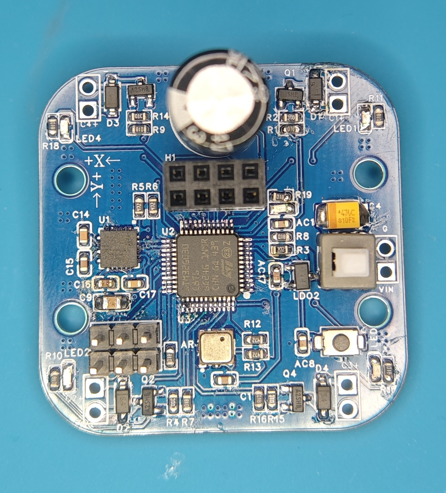
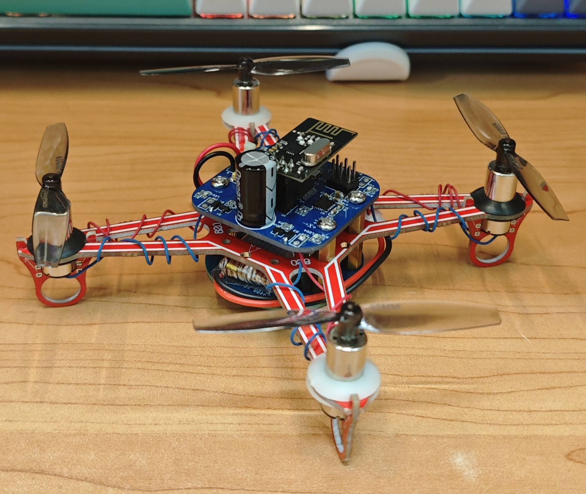

# 项目名称：STM32四轴飞行器
## 介绍：
- 该项目是一个基于STM32G030C8T6作为主控芯片而开发的飞控，之所以使用G030是因为G030提供精确的内部时钟，不必再添加外部时钟源，避免pcb布局空间不够。
- 姿态判断使用了MPU6050陀螺仪模块和BMP180气压传感器，无线遥控使用了SI24R1模块(与NRF24L01模块通用)
- 该飞控模块与我另一个开源的遥控器所适配 -> [FlyController](https://github.com/vitaminHurricane/FlyController)
- 该飞控所搭配的机架在某宝搜索
__空心杯机架__ 关键词即可
- 该飞机使用空心杯电机作为动力源，3.7V软包玩具电池供电
## 原理图
该飞控原理图使用了立创开源广场上的开源飞控原理图 -> 
[立创开源广场](https://oshwhub.com/nevet/fly_main_board)

[飞控原理图](schematic/SCH_FlyControl.pdf)
## BOM清单：
[飞控BOM清单](schematic/BOM_PCB5_FlyControl.xlsx)

## 飞控实物图：

## 飞机器实物图：

## 控制方法：
- 使用三套PID分别对飞机Pitch, Roll, Yaw三个欧拉角进行姿态控制。
- 通过遥控器给飞机发送目标姿态角，再让PID自动调节飞机姿态。
## 存在缺陷：
- 无法使用BMP180气压传感器测量海拔，根据数据手册介绍方法对芯片初始化采样后无法正常计算海拔，换了芯片也是如此，但是芯片的温度传感却能正确反馈环境温度，所以舍弃了气压计的功能。
- 仅仅依靠三套PID对飞机姿态进行控制，无法做到精确控制，会有偏差，无法悬停
- 每次换不同位置起飞时，可能是姿态解算问题，导致平衡点偏移，可能会朝着某个方向平飞，换电池也会影响平衡点

